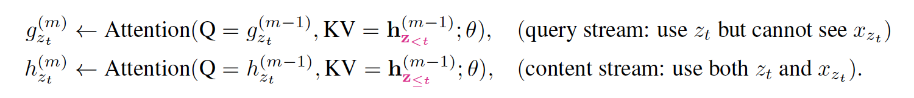
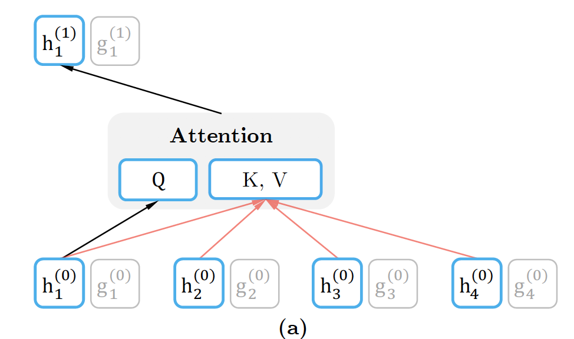
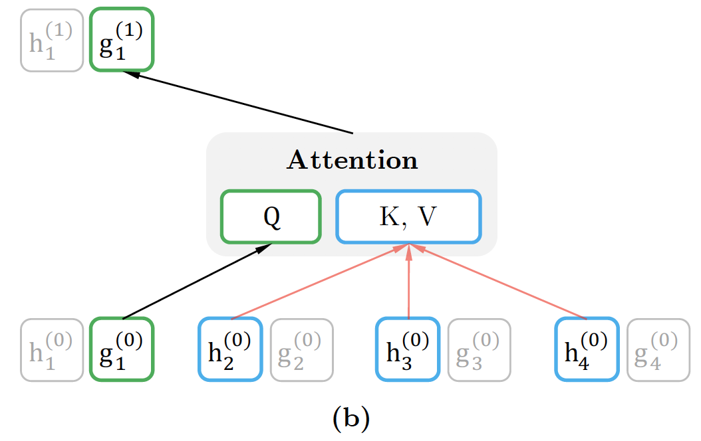

### 作业要求
- 找到xlnet代码中计算双流注意力的部分代码，并对其进行分析。
提交：
- 1、xlnet中双流注意力代码片段（可从以下链接中选取）（60'）
- 2、基于代码的流程分析，可以在代码中写好中文注释，或在单独文档文字描述也可以画流程图
- 基本流程无问题（20’）
- 分析正确无错误（10’）
- 分析详细，语言描述清楚（10’）
  

### 作业描述
- 关于xlnet中的双流注意力代码片段
- 该片段在https://github.com/zihangdai/xlnet中的modeling.py文件的第319行到382行如下：
```python
    def two_stream_rel_attn(h, g, r, mems, r_w_bias, r_r_bias, seg_mat, r_s_bias,
                        seg_embed, attn_mask_h, attn_mask_g, target_mapping,
                        d_model, n_head, d_head, dropout, dropatt, is_training,
                        kernel_initializer, scope='rel_attn'):
  """该函数是针对相对正编码进行双向流自注意力的设计"""

  scale = 1 / (d_head ** 0.5)
  with tf.variable_scope(scope, reuse=False):

    # 基于内容content的注意力分数计算方法，将mems和h拼接起来
    if mems is not None and mems.shape.ndims > 1:
      cat = tf.concat([mems, h], 0)
    else:
      cat = h

    # 基于文本内容的键头部（注意力机制QKV中的k部分）
    k_head_h = head_projection(
        cat, d_model, n_head, d_head, kernel_initializer, 'k')

    # 基于文本内容的值头部（注意力机制QKV中的V部分）
    v_head_h = head_projection(
        cat, d_model, n_head, d_head, kernel_initializer, 'v')

    # 基于位置的键头部
    k_head_r = head_projection(
        r, d_model, n_head, d_head, kernel_initializer, 'r')

    ##### 文本表示流h_theta
    # 文本内容流的查询头部
    q_head_h = head_projection(
        h, d_model, n_head, d_head, kernel_initializer, 'q')

    # 核心注意力机制的操作函数调用
    attn_vec_h = rel_attn_core(
        q_head_h, k_head_h, v_head_h, k_head_r, seg_embed, seg_mat, r_w_bias,
        r_r_bias, r_s_bias, attn_mask_h, dropatt, is_training, scale)

    # 文本内容流输出的函数post_attention()。
    output_h = post_attention(h, attn_vec_h, d_model, n_head, d_head, dropout,
                              is_training, kernel_initializer)

  with tf.variable_scope(scope, reuse=True):
    ##### 查询表示流g_theta
    # 查询表示流的query头部
    q_head_g = head_projection(
        g, d_model, n_head, d_head, kernel_initializer, 'q')

    # 核心的注意力机制操作c
    if target_mapping is not None:
      q_head_g = tf.einsum('mbnd,mlb->lbnd', q_head_g, target_mapping)
      attn_vec_g = rel_attn_core(
          q_head_g, k_head_h, v_head_h, k_head_r, seg_embed, seg_mat, r_w_bias,
          r_r_bias, r_s_bias, attn_mask_g, dropatt, is_training, scale)
      attn_vec_g = tf.einsum('lbnd,mlb->mbnd', attn_vec_g, target_mapping)
    else:
      attn_vec_g = rel_attn_core(
          q_head_g, k_head_h, v_head_h, k_head_r, seg_embed, seg_mat, r_w_bias,
          r_r_bias, r_s_bias, attn_mask_g, dropatt, is_training, scale)

    # 后处理输出查询表示内容output_g
    output_g = post_attention(g, attn_vec_g, d_model, n_head, d_head, dropout,
                              is_training, kernel_initializer)

    return output_h, output_g
```

- 这个函数实现的是文本content的表示，以output_h作为代表；另一个实现的是查询query的表示，以output_g为代表。期代码实现的公式是：



- 其中，关于content stream attentioin过程下图所示：


- 关于query stream attention过程如下图所示：
